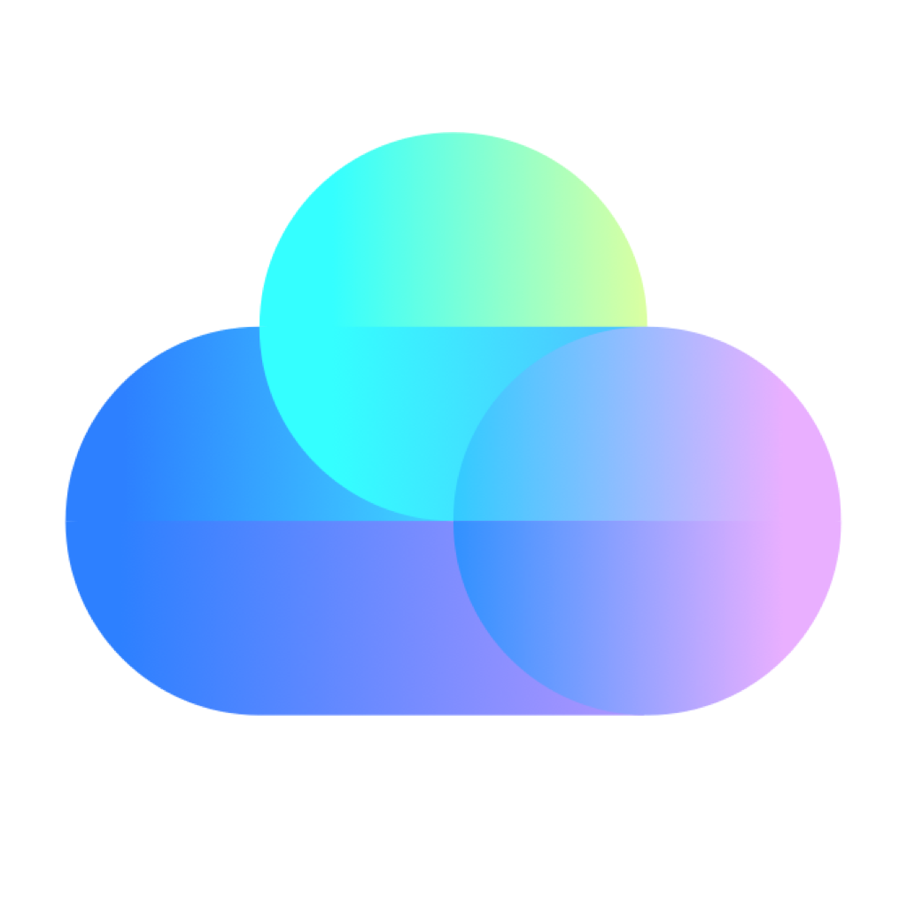

Welcome to CloudCamp.

The easiest way to get started is to [take the tutorial](/docs/tutorial). In
around 40 minutes, you will learn how to automate any cloud application with a
minimum amount of effort.

<button
  class="text-white rounded-md  font-medium flex items-center px-4"
  style="background-color: #3F223D;"
  onclick="location.href='/docs/tutorial'">

Take the tutorial

</button>

# Introduction

CloudCamp is a framework for building infrastructure as code, based on Cloud
Development Kit (CDK) from Amazon. You can use it to create and manage your
webservices, databases, run your migrations and much more.

CloudCamp is optimized for developer happiness. Even for small projects, it will
help you launch faster than by using config files or the web console of AWS. As
your app grows, CloudCamp makes upgrading and extending your infrastructure as
well as deploying new versions painless - it's just a git push to your main
branch.
